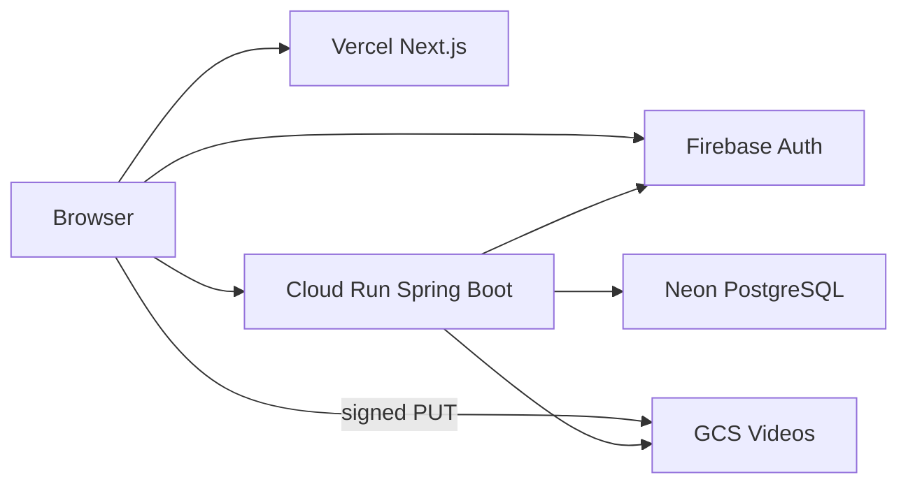

# V-Beta

A web app for indoor climbers to find gym problems, share **beta** (how to climb a route), and keep that knowledge tied to a wall even after it is reset.

Built as a full-stack capstone for community use at Minnesota Climbing Cooperative. Live staging is public.

**Try it:** [https://v-beta-mncoop.vercel.app/](https://v-beta-mncoop.vercel.app/)  
The first click after idle can take 10–30 seconds (API and database scale to zero). After that, browse as a guest or sign in with email/Google.

API health: [https://v-beta-api-6vqd6rspuq-ue.a.run.app/api/health](https://v-beta-api-6vqd6rspuq-ue.a.run.app/api/health)

## What it does

Climbers usually swap beta in person or in disappearing videos. V-Beta stores comments and solution videos **on the problem**, with grades, wall sections, and a moderation loop for the gym.

| Role | Can do |
|---|---|
| **Guest** | Browse walls and problems, filter/sort by grade |
| **Climber** | Comment, upload beta video, suggest a grade, report content, appeal a removal once |
| **Setter** | Create and manage problems on a wall |
| **Admin** | Walls, roles, report queue, logbook, appeal review |

Shipped product surface:

- Email/password and Google sign-in (Firebase), email verification, password reset
- Wall sections and climbing problems with lifecycle (active / archived on wall reset)
- Discussion: comments + solution-beta upload via GCS signed URLs
- Perceived-grade suggestions
- Grade-range filter and sort (recent / easiest / hardest)
- Reports → ranked admin queue → dismiss or delete with notes → in-app notifications → owner appeal → admin restore or deny

User-facing guide: [`docs/user-manual.md`](./docs/user-manual.md). Moderation details: [`docs/features/moderation.md`](./docs/features/moderation.md).

## Architecture



The browser authenticates with Firebase, then sends ID tokens to the API. Spring Security validates tokens and enforces **role/action permissions** from the database. Videos never go through the API body: the server issues a short-lived signed PUT URL; playback uses a public GCS URL.

| Layer | Stack |
|---|---|
| Frontend | Next.js 16 (App Router), React 19, Tailwind / shadcn |
| Backend | Spring Boot 3.4, Spring Security, JPA/Hibernate, Java 17 |
| Auth | Firebase Auth (web SDK + Admin SDK) |
| Data | PostgreSQL (Neon in staging; local/Cloud SQL for laptop) |
| Media | Google Cloud Storage |
| Hosting | Vercel + Cloud Run (`us-east1`, scale-to-zero) |

Engineering notes recruiters often look for:

- Split frontend/API with CORS and env-driven origins (not a monolith)
- `ddl-auto=validate` — schema is versioned SQL, not surprise Hibernate migrations in prod
- Backend integration tests against a dedicated `v_beta_test` Postgres (Docker locally, GitHub Actions on PRs)
- Frontend unit tests (Jest) on PRs
- Secrets stay out of the image (Cloud Run Secret Manager file mounts)

## Live staging

| Piece | Where |
|---|---|
| App | [https://v-beta-mncoop.vercel.app/](https://v-beta-mncoop.vercel.app/) |
| API | [https://v-beta-api-6vqd6rspuq-ue.a.run.app](https://v-beta-api-6vqd6rspuq-ue.a.run.app) |
| Database | Neon `v_beta` (not public) |
| Frontend host | Vercel, Root Directory `v-beta` |
| API host | Cloud Run service `v-beta-api` |

Vercel env (baked at build time): `NEXT_PUBLIC_API_BASE_URL` → Cloud Run URL, `NEXT_PUBLIC_APP_ORIGIN` → the Vercel origin. Provision and ops: [`docs/setup/deployment.md`](./docs/setup/deployment.md).

## Repository

```
v-beta/    Next.js app
server/    Spring Boot API (`Dockerfile` for Cloud Run)
docs/      requirements, architecture, API, testing, setup
```

## Run locally

1. [`docs/README.md`](./docs/README.md) — setup index
2. `server/.env` and `v-beta/.env.local` — see [`docs/setup/environment-variables.md`](./docs/setup/environment-variables.md)
3. From `server/`: `./mvnw spring-boot:run` → `http://localhost:8080`
4. From `v-beta/`: `npm install` && `npm run dev` → `http://localhost:3000`

Keep local `.env` on `127.0.0.1`. Staging Neon belongs on Cloud Run, not a second git branch.

## Documentation

| Doc | What it covers |
|---|---|
| [`docs/README.md`](./docs/README.md) | Full index |
| [`docs/requirements.md`](./docs/requirements.md) | Scope and functional requirements |
| [`docs/user-manual.md`](./docs/user-manual.md) | How to use the app by role |
| [`docs/setup/deployment.md`](./docs/setup/deployment.md) | Vercel, Cloud Run, Neon |
| [`docs/architecture/system-overview.md`](./docs/architecture/system-overview.md) | System design |
| [`docs/api/endpoints.md`](./docs/api/endpoints.md) | REST API |
| [`docs/testing/README.md`](./docs/testing/README.md) | Test strategy and CI |
| [`docs/known-issues-and-limitations.md`](./docs/known-issues-and-limitations.md) | Honest gaps (e.g. no E2E yet, keyword search later) |

Team workflow: [`docs/contributing/git-workflow.md`](./docs/contributing/git-workflow.md).
