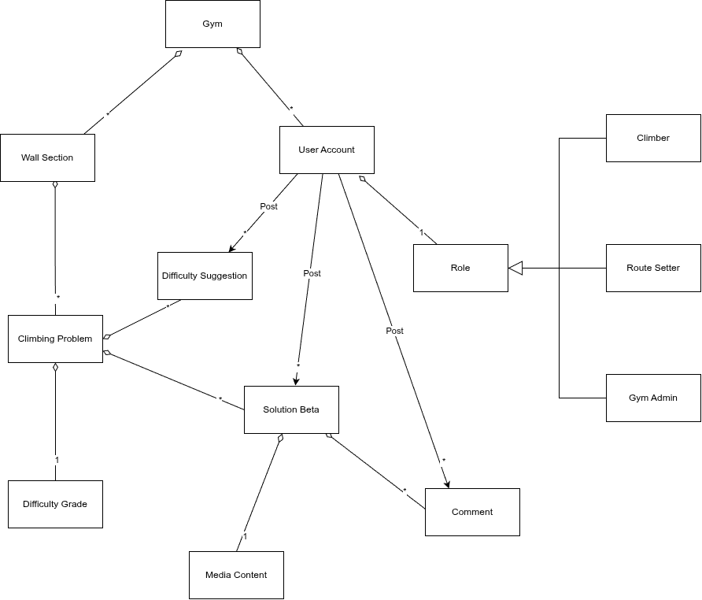
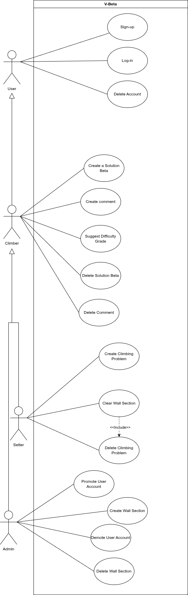
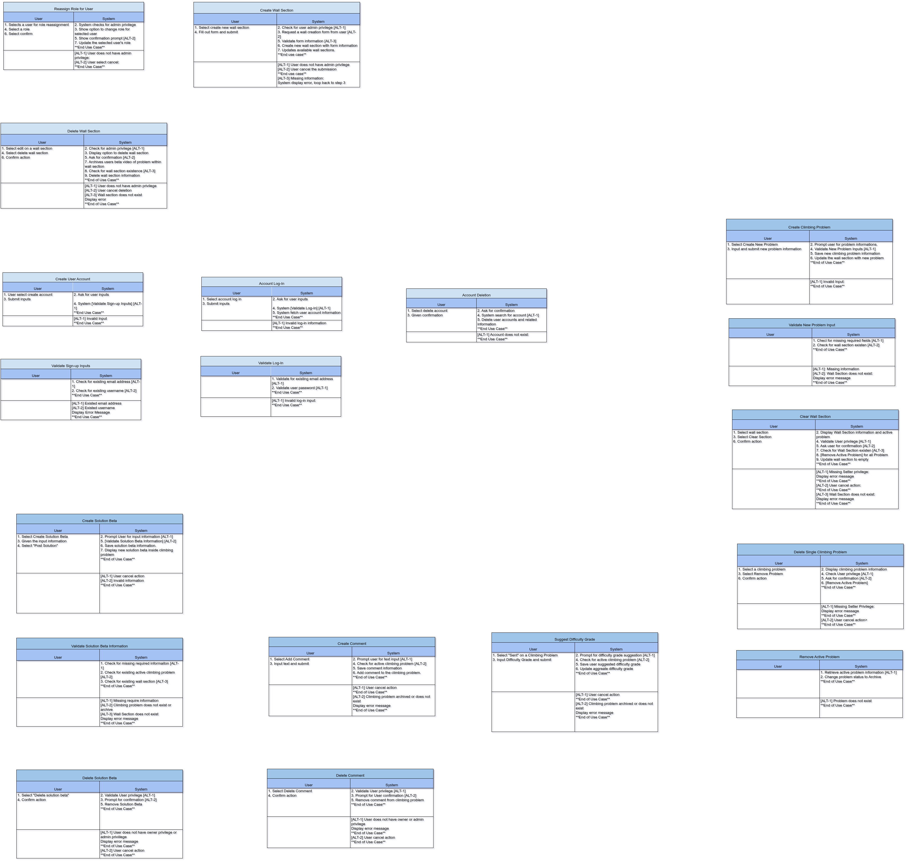
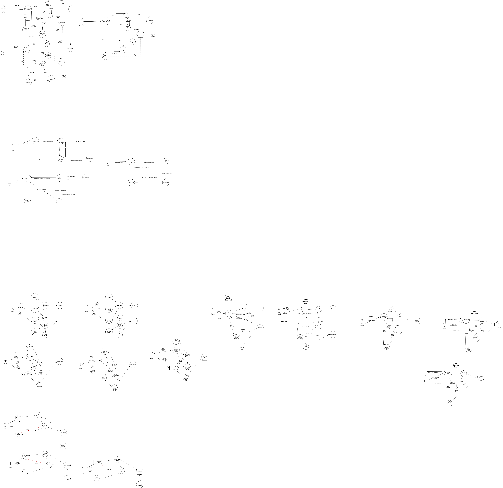
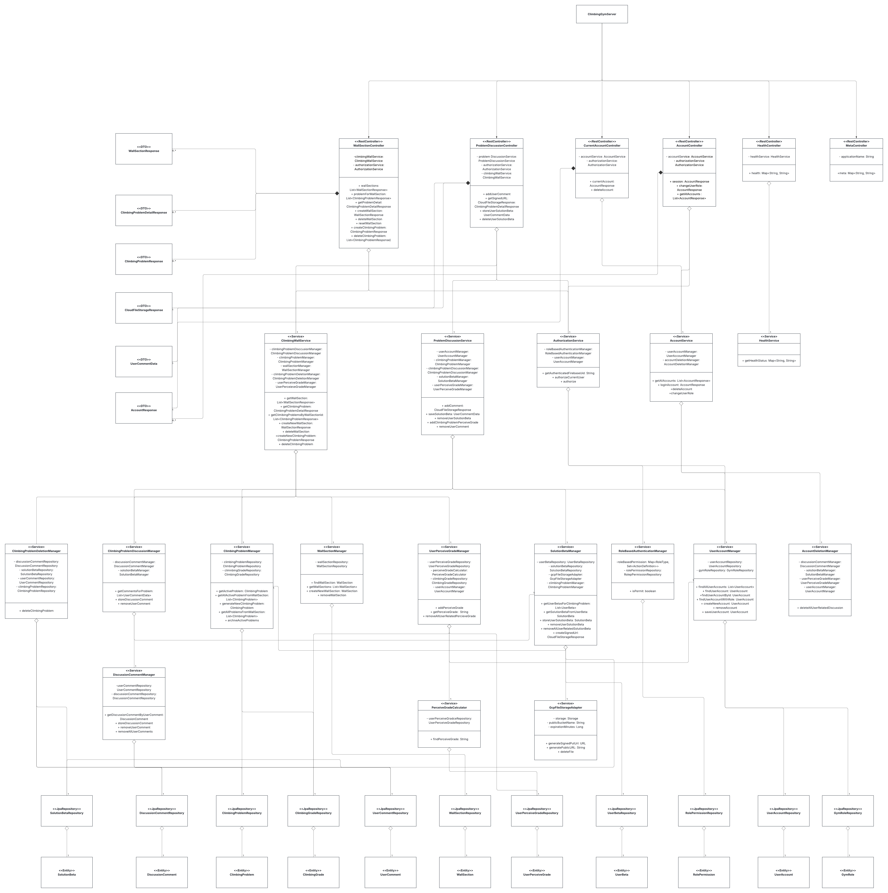

# Architecture Diagrams

This folder contains the visual diagrams used to document the system architecture and design.

## Overview

The diagrams are ordered below in the recommended review sequence for the project narrative.

For design rationale and code mapping context, see:

- [`docs/architecture/design-rationale.md`](../design-rationale.md)

## Diagram Index

1. [Domain Class Diagram](#domain-class-diagram)
2. [Use Case Diagram](#use-case-diagram)
3. [Use Case Scenarios](#use-case-scenarios)
4. [Robustness Diagram](#robustness-diagram)
5. [Sequence Diagram](#sequence-diagram)
6. [Class Diagram](#class-diagram)
7. [Database Diagram](#database-diagram)

---

## Domain Class Diagram

- File: `domain-name/Domain-Name-Diagram.png`

## Use Case Diagram

- File: `use-case/use-case-diagram.png`

## Use Case Scenarios

- File: `user-case-scenarios/use-case-scenarios.png`

## Robustness Diagram

- File: `robustness/robustness.png`

## Sequence Diagram

- File: `sequence/sequence-diagram.png`

## Class Diagram

- File: `class/uml_class.png`

## Database Diagram

- File: `database/database.png`

