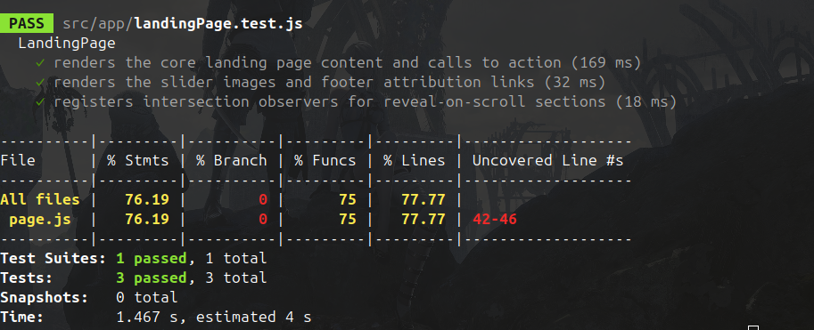

# Frontend Test Report

This document summarizes the `v-beta` frontend automated test run.

## Test Run Metadata

- **Date:** 2026-04-26
- **Component:** `v-beta/` (Next.js frontend)
- **Commands executed:**
  - `npm test -- --watchAll=false`

## Overall Result

- **Unit tests (`npm test`):** PASS
  - Test suites: 6 passed, 6 total
  - Tests: 72 passed, 72 total
  - Snapshots: 0 total
  - Time: 3.285 s

## Coverage Snapshot (From Jest Output)

- **All files (overall):**
  - Statements: **83.69%**
  - Branches: **69.72%**
  - Functions: **89.62%**
  - Lines: **86.54%**

- **Per-page highlights:**
  - `app/page.js` — Stmts 76.19%, Branch 0%, Funcs 75%, Lines 77.77%
  - `app/account/page.js` — Stmts 100%, Branch 95%, Funcs 100%, Lines 100%
  - `app/accounts/page.js` — Stmts 93.4%, Branch 87.75%, Funcs 94.11%, Lines 96.47%
  - `app/main-page/page.js` — Stmts 85.39%, Branch 72.09%, Funcs 86.66%, Lines 87.05%
  - `app/wall/[wallSectionID]/page.js` — Stmts 85.11%, Branch 75.51%, Funcs 84.61%, Lines 89.61%
  - `app/wall/[wallSectionID]/problem/[problemId]/page.js` — Stmts 75.64%, Branch 62.25%, Funcs 93.54%, Lines 78.53%
  - `ui/appTheme.js` — Stmts 100%, Branch 100%, Funcs 100%, Lines 100%

## Evidence to Commit (GitHub)

- Test execution screenshot:
  - `docs/testing/evidence/frontend/npm-test-summary.png`



## Console Evidence Excerpt

```text
Test Suites: 6 passed, 6 total
Tests:       72 passed, 72 total
...
```
